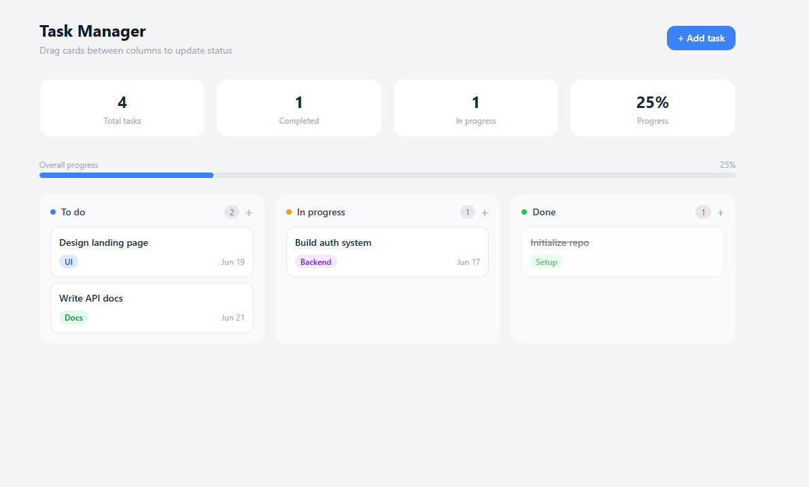

# Task Manager

A Kanban-style task manager built with React, featuring drag-and-drop, persistent storage, and a clean, modern UI.

🌐 [Live demo:](https://task-manager-blond-rho.vercel.app/)



## Features

- 🗂️ Three-column Kanban board (To do, In progress, Done)
- 🖱️ Drag and drop tasks between columns
- ➕ Add tasks with title, tag, column, and due date via modal form
- 🏷️ Color-coded tags (UI, Backend, Docs, Bug, Setup, DevOps, Other)
- 💾 Tasks persist in localStorage — no backend required
- 📊 Live stats: total tasks, completed, in progress, and overall progress bar
- 🗑️ Delete tasks with a single click

## Tech Stack

- React 19
- Tailwind CSS 3
- @hello-pangea/dnd (drag and drop)
- Vite
- Deployed on Vercel

## Technical decisions

- **Custom hook (`useTasks`)** — centralizes all state logic (add, delete, move, persist) separately from UI components, following the same pattern used in my [Weather App](https://github.com/TU_USUARIO/weather-app) project.
- **Immutable state updates** — every update creates new arrays/objects instead of mutating existing ones, which is required for React to correctly detect changes and re-render.
- **localStorage persistence** — chosen to keep the project fully client-side and easy to run without any backend setup.

## Run locally

```bash
git clone https://github.com/TU_USUARIO/task-manager.git
cd task-manager
npm install
npm run dev
```

## Author

Eduardo Chan — [linkedin.com/in/chaneduardo](https://linkedin.com/in/chaneduardo)